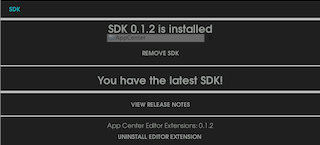

# App Center Unity Editor Extensions

Welcome to the home of App Center Unity Editor Extension plugin, the best interface for viewing and configuring our App Center Unity SDK.
We will be adding to this platform as App Center's Unity SDK features grow.

## Features:

* **Automated SDK installation, upgrading & removal** - Now pain free!
* **Easy to follow help links** - Link to *Release Notes*

## Setup:
  
1. Download [this Asset Package](https://github.com/Microsoft/AppCenter-SDK-Unity-Extension/releases "AppCenter-SDK-Unity-Extension.unitypackage") and import into a new or existing project.
2. Open the Editor Extensions via the Unity menu: **Window > App Center > Editor Extensions** 
3. Editor Extensions will automatically detect if you have a App Center SDK installed.

## How it works:
App Center Editor Extensions is a stand-alone Unity plug-in that streamlines getting started with App Center.  All of the Editor Extensions code lives in editor folders within your Unity Project. This prevents any of the editor code from being compiled into the game build. 

### Ongoing Development:
Editor Extensions is an attempt to make a first class App Center development experience within the Unity Editor. We consider this project a sandbox and are always open to feedback from our community developers. 

##### A word of caution:
You may move our plugin folder around; however, we discourage renaming the root(*AppCenterEditorExtensions*) folder. This may cause the relative links within the plugin to break.

## Copyright and Licensing Information:

  Apache License -- Version 2.0, January 2004 [http://www.apache.org/licenses/](http://www.apache.org/licenses/)

  License Details available in [LICENSE.txt](https://github.com/Microsoft/AppCenter-SDK-Unity-Extension/blob/master/LICENSE "Apache 2.0 License")